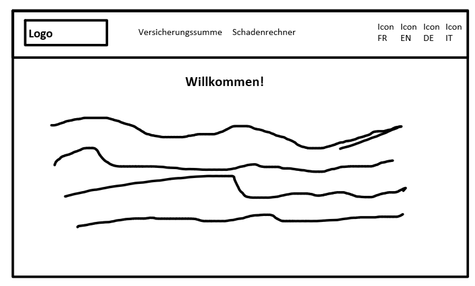
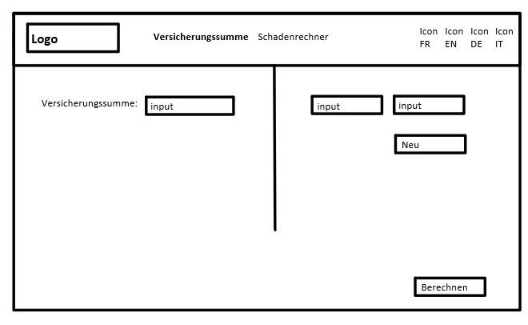
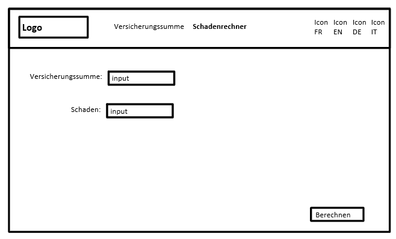
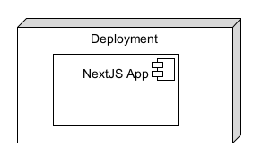

# Schadendeckungsrechner Hausrat Ael Banyard

## Inhalt

* [Problem Statement](##Problem Statement)
* [Userstory](##Userstory)
* [KeyScreens](##KeyScreens)
  * [Index](###Index)
  * [Versicherungssumme](###Versicherungssumme)
  * [Schadenrechner](###Schadenrechner)

* [System](##System)

## Problem Statement

| Nutzende / Zielgruppe                            | Probleme                                                     | Lösungsansätze                                               | Metriken                                                     | Stakeholder                                      | Risiken                                                      |
| ------------------------------------------------ | ------------------------------------------------------------ | ------------------------------------------------------------ | ------------------------------------------------------------ | ------------------------------------------------ | ------------------------------------------------------------ |
| Person mit neue Hausrat die sich versichern will | Sie will sich Versichern. Sie versteht Versicherungen nicht. | Er informiert sich selbst. Er geht zu einer Versicherung und fragt nach. | Es muss verständlich sein. Sie soll es verstehen.       | Person mit neue Hausrat die sich versichern will | Sie versichert sich nicht. Sie versichert sich nicht richtig. |
| Person mit neu gekauften Eigentum                | Sie will seine Versicherungssumme anpassen. Sie will sich nicht Über- oder Unterversichern. | Es selbst berechnen. Eine Versicherung fragen. Den Rechner verwenden. | Keine Über- oder Unterversicherung. Es muss verständlich sein. | Person mit neu gekauften Eigentum                | Versichert sich zu knapp.                                    |
| Person mit Schaden                               | Sie will wissen wie viel sie selbst bezahlen muss. Sie will wissen wie viel von der Versicherung übernommen wird. | Selbst berechnen. Versicherung fragen. Rechner verwenden. | Es muss verständlich sein.                                   | Person mit Schaden                               | Findet es nicht heraus. Weiss die Versicherungssumme nicht. |
| Person welche Deutsch nicht sprechen kann        | Versteht kein Deutsch. Will sich versichern. Versteht Versicherung nicht. | Informiert sich selbst. Fragt Versicherung. Benutzt Seite welche in andere Sprache übersetzt ist. | Es muss verständlich sein. Sie muss es verstehen.       | Person welche Deutsch nicht sprechen kann        | Sie versichert sich nicht. Sie versichert sich nicht richtig. Versteht es nicht. |

## Userstory

<table>
	<tr>
    	<td style="background-color: blue; color: white;">Versicherungssumme berechnen (Versicherungswert)</td>
    </tr>
    <tr>
    <td style="background-color: green; color: white;">Webseite öffnen</td>
    <td style="background-color: green; color: white;">Versicherungssumme Tab öffnen</td>
    <td style="background-color: green; color: white;">Versicherungswert eingeben</td>
    <td style="background-color: green; color: white;">berechnen drücken</td>
    </tr>
    <tr>
    <td style="background-color: yellow;">Browser</td>
    <td style="background-color: yellow;">Navigation unten oder oben</td>
    <td style="background-color: yellow;">Input Feld</td>
    <td style="background-color: yellow;">Knopf</td>
    </tr>
    <tr>
    <td></td>
    <td></td>
    <td></td>
    <td style="background-color: yellow;">Ausgabe Feld</td>
    </tr>
</table>

<table>
	<tr>
    	<td style="background-color: blue; color: white;">Versicherungssumme berechnen</td>
    </tr>
    <tr>
    <td style="background-color: green; color: white;">Webseite öffnen</td>
    <td style="background-color: green; color: white;">Versicherungssumme Tab öffnen</td>
    <td style="background-color: green; color: white;">Alle Gegenstände eingeben (Name und Wert)</td>
    <td style="background-color: green; color: white;">berechnen drücken</td>
    </tr>
    <tr>
    <td style="background-color: yellow;">Browser</td>
    <td style="background-color: yellow;">Navigation unten oder oben</td>
    <td style="background-color: yellow;">2x Input Feld</td>
    <td style="background-color: yellow;">Knopf</td>
    </tr>
    <tr>
    <td></td>
    <td></td>
    <td style="background-color: yellow;">Knopf für neuer Gegenstand</td>
    <td style="background-color: yellow;">Ausgabe Feld</td>
    </tr>
</table>

<table>
	<tr>
    	<td style="background-color: blue; color: white;">Schaden berechnen</td>
    </tr>
    <tr>
    <td style="background-color: green; color: white;">Webseite öffnen</td>
    <td style="background-color: green; color: white;">Schadenrechner Tab öffnen</td>
    <td style="background-color: green; color: white;">Versicherungssumme eingeben</td>
    <td style="background-color: green; color: white;">Schaden eingeben</td>
    <td style="background-color: green; color: white;">berechnen drücken</td>
    </tr>
    <tr>
    <td style="background-color: yellow;">Browser</td>
    <td style="background-color: yellow;">Navigation unten oder oben</td>
    <td style="background-color: yellow;">Input Feld</td>
    <td style="background-color: yellow;">Input Feld</td>
    <td style="background-color: yellow;">Knopf</td>
    </tr>
    <tr>
    <td></td>
    <td></td>
    <td></td>
    <td></td>
    <td style="background-color: yellow;">Ausgabe Feld</td>
    </tr>
</table>

<table>
	<tr>
    	<td style="background-color: blue; color: white;">Sprache ändern</td>
    </tr>
    <tr>
    <td style="background-color: green; color: white;">Webseite öffnen</td>
    <td style="background-color: green; color: white;">Sprache auswählen</td>
    </tr>
    <tr>
    <td style="background-color: yellow;">Browser</td>
    <td style="background-color: yellow;">Navigation unten oder oben</td>
    </tr>
    <tr>
    <td></td>
    <td style="background-color: yellow;">Sprachen auswahl in Navigation</td>
    </tr>
</table>

## KeyScreens

### Index

### Versicherungssumme

### Schadenrechner

## System

Die ganze Applikation wird in einer NextJS Applikation sein, damit ich einfach eine Rest API einbauen kann wann ich will.
